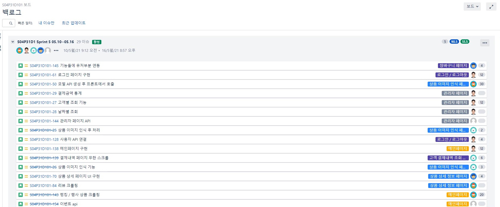
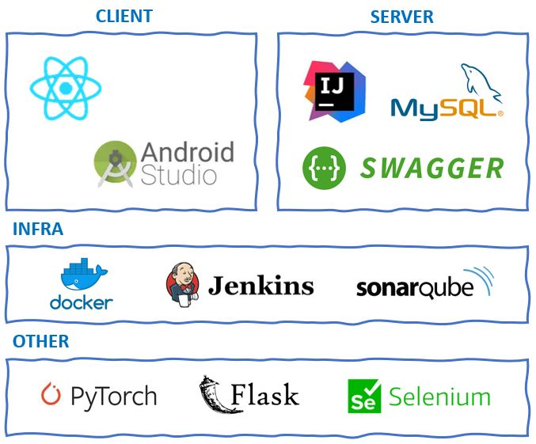

## 신세계 아이앤씨 가상 장바구니 App Web 개발 (안드로이드 앱)

​                     

​                   

## 🔖우리 조는 4주동안...

#### 270여개의 **commit**과 30여개의 **branch** 가 있었어요!

<div align="center" style="display:flex;">
	
</div>

​                        

| ISSUE                              |
| ---------------------------------- |
|  |
| Jira를 이용한 애자일 개발 방식     |

​                          

## 📋 Function chart

1. 바코드 스캐닝 / 상품 이미지 인식 으로 상품 조회 및 장바구니 추가
2. 쉐이크 모션으로 바코드 스캐닝 페이지 오픈 
3. [관리자 페이지] 고객별 결제 정보 조회 및 통계 기능
4. 앱 비정상 종료 시 장바구니 불러오기

<여기에 앱 화면 캡쳐해서 들어갈 예정~>

​                      

## 🛠 Using Technology

<div align="center" style="display:flex;">
	
</div>


* Front-End: [React Native](https://reactnative.dev/)
* Back-End: [IntelliJ](https://www.jetbrains.com/ko-kr/idea/), [MySQL](https://www.mysql.com/), [Swagger](https://swagger.io/)
* Infra: [Docker](https://www.docker.com/), [Jenkins](https://www.jenkins.io/), [SonarQube](https://www.sonarqube.org/)
* Image-Classification: [Pytorch](https://pytorch.org/), [Flask](https://flask.palletsprojects.com/en/2.0.x/), [EfficientNet-B0](https://github.com/lukemelas/EfficientNet-PyTorch)
* Image-Crawling : [Selenium](https://selenium-python.readthedocs.io/)

​                       

## :star: 실행 방법

##### 안드로이드 폰이 없는 경우 (안드로이드 스튜디오를 이용해 컴퓨터에서 에뮬레이터 실행)

1. 링크에서 안드로이드 스튜디오 설치

   https://reactnative.dev/docs/environment-setup

2. 제어판 > 시스템 및 보안 > 시스템 > 고급 시스템 설정 > 환경 변수 > 사용자 변수에 아래 추가
    변수 이름 : ANDROID_HOME
    변수 값 : C:\Users\사용자명\AppData\Local\Android\Sdk

3. 시스템 변수 > Path >  새로 만들기
    C:\Users\사용자명\AppData\Local\Android\Sdk\platform-tools

4. 안드로이드 스튜디오에서 frontend 폴더 열기

    안드로이드 스튜디오 > AVD manager > Pixel 4 > next > x86 Images R 선택> Next > Finish

5. 프로젝트 실행

   ```
   cd frontend
   
   npm install -g react-native-cli
   
   npm install 
   
   react-native link
   
   react-native run-android
   ```

   ​             

##### 안드로이드 폰이 있는 경우 (개발자 도구를 이용해 폰에서 앱 실행)

1. usb 케이블을 이용해 핸드폰과 컴퓨터와 연결

2. 핸드폰의 설정 > 휴대전화 정보 > 소프트웨어 정보 > 빌드번호를 7번 탭

3. 핸드폰의 설정 > 휴대전화 정보 밑에 개발자 옵션이 생김

4. 개발자 옵션에서 USB 디버깅을 허용

5. 컴퓨터 제어판 > 시스템 및 보안 > 시스템 > 고급 시스템 설정 > 환경 변수 > 사용자 변수에 아래 추가
   변수 이름 : ANDROID_HOME
     변수 값 : C:\Users\사용자명\AppData\Local\Android\Sdk

6. 시스템 변수 > Path >  새로 만들기
   C:\Users\사용자명\AppData\Local\Android\Sdk\platform-tools

7. visual studio code 에서 frontend 폴더 열기

   ```
   cd frontend
   
   npm install -g react-native-cli
   
   npm install 
   
   react-native link
   
   react-native run-android
   ```

   ​                   

## 💻 팀원

* 팀장 강유정([@yujeong0](https://github.com/yujeong0 "github link"))
* 팀원 강민창([@minchang0116](https://github.com/minchang0116 "github link"))
* 팀원 곽충섭([@NICEGINI](https://github.com/NICEGINI "github link"))
* 팀원 이지원
* 팀원 지서연([@seoyounji](https://github.com/seoyounji "github link"))

​                       

## ⚙️ Libraries

### Front-end

```json
"dependencies": {
    "@react-native-async-storage/async-storage": "^1.15.4",
    "@react-native-community/datetimepicker": "^3.4.7",
    "@react-native-community/masked-view": "^0.1.10",
    "@react-native-picker/picker": "^1.15.0",
    "@react-navigation/native": "^5.9.4",
    "@react-navigation/stack": "^5.14.4",
    "@reduxjs/toolkit": "^1.5.1",
    "axios": "^0.21.1",
    "crypto-js": "^4.0.0",
    "date-fns": "^2.21.1",
    "moment": "^2.29.1",
    "native-base": "^2.15.2",
    "react": "17.0.1",
    "react-native": "0.64.0",
    "react-native-camera": "^3.43.6",
    "react-native-camera-kit": "^11.1.0",
    "react-native-easy-grid": "^0.2.2",
    "react-native-gesture-handler": "^1.10.3",
    "react-native-modal": "^11.10.0",
    "react-native-reanimated": "^2.1.0",
    "react-native-safe-area-context": "^3.2.0",
    "react-native-screens": "^3.1.1",
    "react-native-shake": "^3.5.2",
    "react-native-snap-carousel": "^3.9.1",
    "react-native-splash-screen": "^3.2.0",
    "react-native-swiper-flatlist": "^3.0.14",
    "react-native-vector-icons": "^8.1.0",
    "react-native-webview": "^11.4.4",
    "react-redux": "^7.2.3",
    "redux": "^4.0.5"
  },
  "devDependencies": {
    "@babel/core": "^7.13.15",
    "@babel/runtime": "^7.13.10",
    "@react-native-community/eslint-config": "^2.0.0",
    "babel-jest": "^26.6.3",
    "eslint": "^7.24.0",
    "jest": "^26.6.3",
    "metro-react-native-babel-preset": "^0.65.2",
    "patch-package": "^6.4.7",
    "react-native-debugger-open": "^0.3.25",
    "react-test-renderer": "17.0.1"
  }
```

### Back-end

```xml
<dependencies>
    <dependency>
        <groupId>org.springframework.boot</groupId>
        <artifactId>spring-boot-starter-data-jpa</artifactId>
    </dependency>
    <dependency>
        <groupId>org.springframework.boot</groupId>
        <artifactId>spring-boot-starter-web</artifactId>
    </dependency>
    <dependency>
        <groupId>org.springframework.boot</groupId>
        <artifactId>spring-boot-starter-security</artifactId>
        <version>2.3.9.RELEASE</version>
    </dependency>

    <dependency>
        <groupId>org.springframework.boot</groupId>
        <artifactId>spring-boot-devtools</artifactId>
        <scope>runtime</scope>
        <optional>true</optional>
    </dependency>
    <dependency>
        <groupId>mysql</groupId>
        <artifactId>mysql-connector-java</artifactId>
        <scope>runtime</scope>
    </dependency>
    <dependency>
        <groupId>org.projectlombok</groupId>
        <artifactId>lombok</artifactId>
        <optional>true</optional>
    </dependency>
    <dependency>
        <groupId>org.springframework.boot</groupId>
        <artifactId>spring-boot-starter-test</artifactId>
        <scope>test</scope>
    </dependency>
    <!-- https://mvnrepository.com/artifact/io.springfox/springfox-swagger2 -->
    <dependency>
        <groupId>io.springfox</groupId>
        <artifactId>springfox-swagger2</artifactId>
        <version>2.9.2</version>
    </dependency>
    <!-- https://mvnrepository.com/artifact/io.springfox/springfox-swagger-ui -->
    <dependency>
        <groupId>io.springfox</groupId>
        <artifactId>springfox-swagger-ui</artifactId>
        <version>2.9.2</version>
    </dependency>
    <dependency>
        <groupId>javax.xml.bind</groupId>
        <artifactId>jaxb-api</artifactId>
        <version>2.3.0</version>
    </dependency>
    <!-- https://mvnrepository.com/artifact/io.jsonwebtoken/jjwt-api -->
    <dependency>
        <groupId>io.jsonwebtoken</groupId>
        <artifactId>jjwt-api</artifactId>
        <version>0.11.2</version>
    </dependency>
    <!-- https://mvnrepository.com/artifact/io.jsonwebtoken/jjwt-impl -->
    <dependency>
        <groupId>io.jsonwebtoken</groupId>
        <artifactId>jjwt-impl</artifactId>
        <version>0.11.2</version>
        <scope>runtime</scope>
    </dependency>
    <!-- https://mvnrepository.com/artifact/io.jsonwebtoken/jjwt-jackson -->
    <dependency>
        <groupId>io.jsonwebtoken</groupId>
        <artifactId>jjwt-jackson</artifactId>
        <version>0.11.2</version>
        <scope>runtime</scope>
    </dependency>
    <!-- https://mvnrepository.com/artifact/org.springframework.security/spring-security-test -->
    <dependency>
        <groupId>org.springframework.security</groupId>
        <artifactId>spring-security-test</artifactId>
        <version>5.3.8.RELEASE</version>
        <scope>test</scope>
    </dependency>
    <!-- https://mvnrepository.com/artifact/commons-codec/commons-codec -->
    <dependency>
        <groupId>commons-codec</groupId>
        <artifactId>commons-codec</artifactId>
        <version>1.9</version>
    </dependency>

</dependencies>
```

